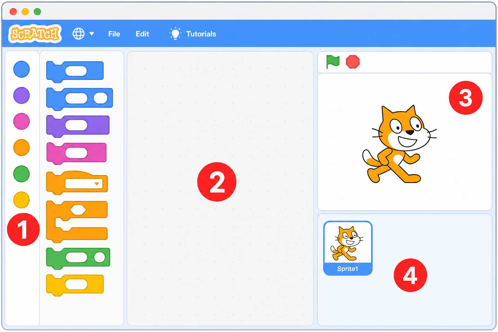
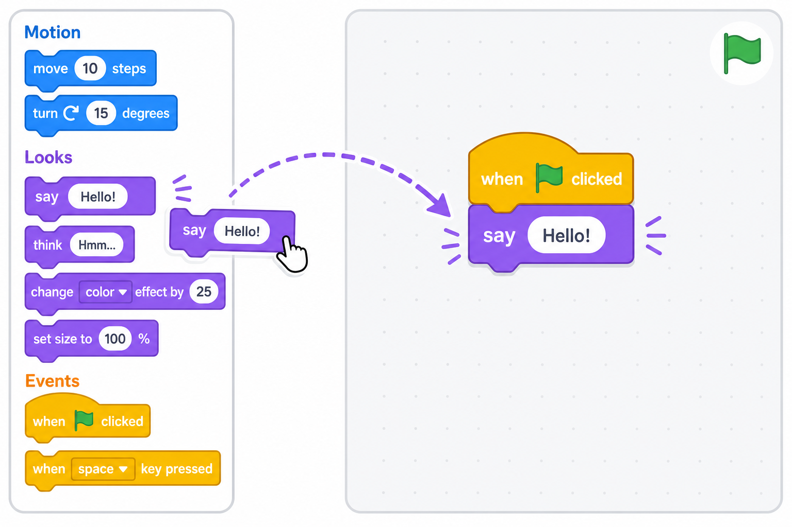
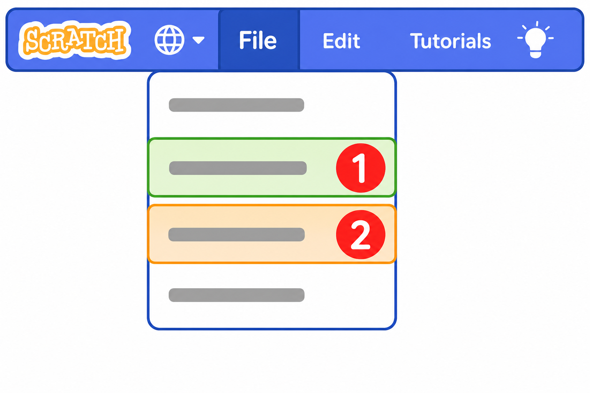

# Scratch 桌面版使用指南（Mac 应用）🖥️🐱

> 适用：**Scratch Desktop**（Mac 安装版，Version 3.32.0）。
> 本课程 **不需要联网、不用打开 scratch.mit.edu 网站**，全部在这个桌面应用里完成！
> 这一篇是 **新手必读**，跟着图一步步来，爸爸妈妈和小鱼都能学会。

---

## 1. 打开 Scratch 🚀

在 Mac 的 **"启动台"** 或 **"应用程序"** 文件夹里，找到橙色小猫图标 🐱（名字叫 **Scratch**），点两下打开它。

> 💡 想让界面变成中文？打开后点最上面那排的 **🌐 地球图标**，在列表里选 **"简体中文"** 即可。
> （下面的图是英文界面，中文界面位置完全一样，只是文字变中文。）

---

## 2. 认识界面：4 个区域 🗺️

打开后看到的样子是这样的（红色数字是我加的标记）：



| 标记 | 区域名字 | 它是干嘛的 |
| :--: | :--- | :--- |
| **1️⃣** | **积木区**（左边）| 所有彩色积木都在这。上面的小圆点是"分类"，点一下就跳到那种积木 |
| **2️⃣** | **脚本区**（中间）| 我们的"工作台"，把积木拖到这里拼起来 |
| **3️⃣** | **舞台**（右上）| 小猫表演的地方。左上角有 🟢 **绿旗（开始）** 和 🔴 **红色按钮（停止）** |
| **4️⃣** | **角色区**（右下）| 显示你有哪些角色（小猫、飞机、子弹…）|

> 🎨 积木分类的颜色要记一记：
> 🔵 运动 · 🟣 外观 · 🟧 事件 · 🟡 控制 · 🟢 运算 · 🟠 变量。

---

## 3. 怎么拖积木？（最重要的动作）🧱

写程序，就是把积木 **从左边拖到中间**，像拼乐高一样拼起来。



**步骤：**
1. 在左边 **积木区** 找到想要的积木（比如紫色的 `说 Hello!`）。
2. **按住鼠标左键**，把它 **拖到中间脚本区**，松手。
3. 想让两块积木连起来，就把下面那块 **靠近上面那块的底部**，看到 **灰色阴影** 出现时松手，"啪"地一下就吸住了！
4. 一段程序通常从一个 **黄色帽子积木** 开始，最常用的是 `当 🟢 被点击`（在 🟧 **事件** 分类里）。

> ❌ 拖错了想删掉？把那块积木 **拖回左边积木区**，松手就删掉了。

---

## 4. 让程序跑起来 ▶️

拼好积木后：
- 点舞台左上角的 **🟢 绿旗** → 程序 **开始运行**！
- 点旁边的 **🔴 红色按钮** → 程序 **停止**。

试试拼这个最小程序，点绿旗看看小猫说话：

```
当 🟢 被点击
说 [你好，我是小猫！] 2 秒
```

---

## 5. 保存作品 / 打开课程文件（.sb3）💾

桌面版的存档是 **.sb3 文件**，存在你自己的电脑里。
点最上面的 **File（文件）** 菜单，会看到下拉菜单：



| 标记 | 菜单项（英文 / 中文）| 作用 |
| :--: | :--- | :--- |
| **1️⃣** | **Save to your computer** / **保存到电脑** | 把现在的作品存成一个 `.sb3` 文件 |
| **2️⃣** | **Load from your computer** / **从电脑中上传** | 打开一个 `.sb3` 文件（比如课程附带的参考答案）|

> 📂 **打开课程参考答案**：课程目录 `course/` 里有 `scratch_lesson_01.sb3` … 这些文件。
> 想看老师做好的范例，就用 **File → Load from your computer（从电脑中上传）**，选中那个 `.sb3` 打开即可。

> 💡 **小提醒**：桌面版没有"自动保存"，做完记得 **File → 保存到电脑**，下次再用 **从电脑中上传** 打开继续！

---

## 6. 常用小操作 🔧

| 想做什么 | 怎么做 |
| :--- | :--- |
| 换个角色（比如飞机）| 右下角 **角色区** 右下角的 🐱➕ 按钮 → 选一个角色 |
| 自己画角色 | 角色区 🐱➕ 按钮 → 选 **🖌️ 画笔（绘制）** |
| 换背景 | 舞台右边最下方的 🏞️➕ 按钮 |
| 新建变量 | 积木区点 🟠 **变量** 分类 → **"建立一个变量"** |
| 放大/缩小积木 | 脚本区右下角的 ➕ ➖ 按钮 |

---

## 7. 遇到问题？排错三连 🛠️

1. **点绿旗没反应？** → 检查程序最上面有没有 `当 🟢 被点击` 这块黄色帽子积木。
2. **积木没连上？** → 两块积木之间有缝，说明没吸住，拖近一点重新对齐。
3. **找不到某块积木？** → 看它是什么颜色，点左边对应颜色的 **分类圆点**。

---

✅ **学会这 7 步，你就能开始上所有 Scratch 课啦！**
每节课开头的"打开 Scratch"，都按 **第 1 步** 来；
要打开范例 `.sb3`，就按 **第 5 步**。开始你的积木冒险吧！🐱🚀
